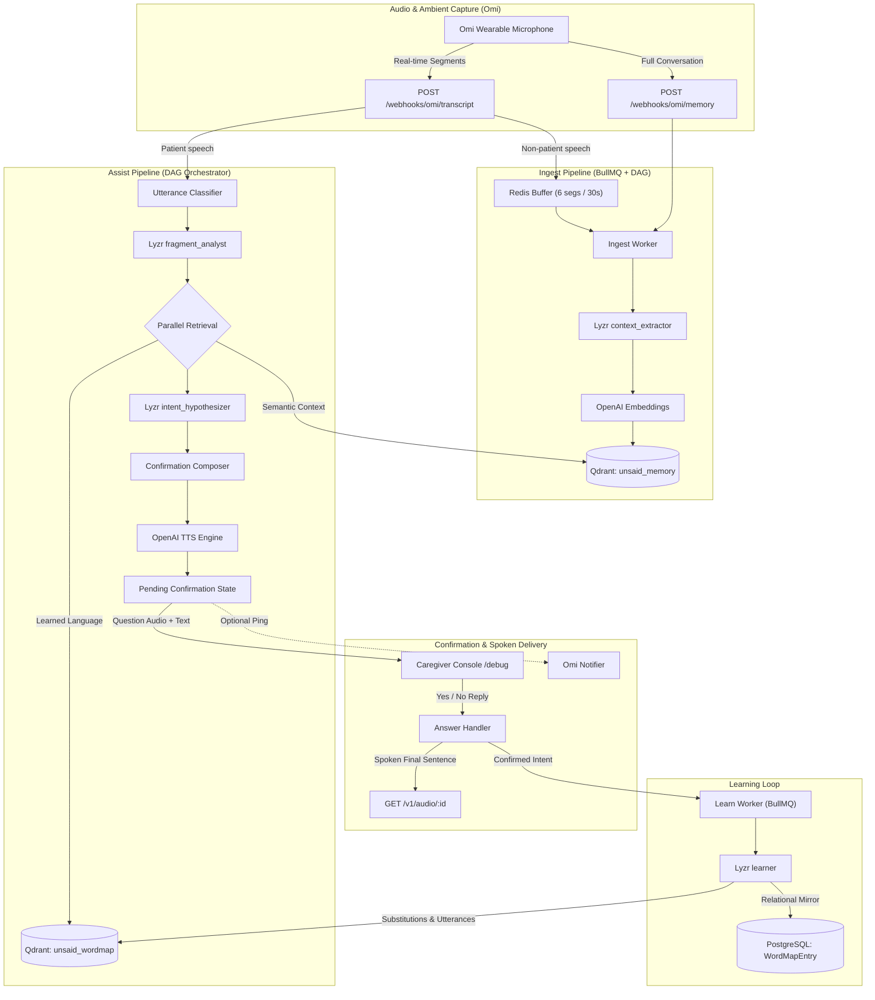
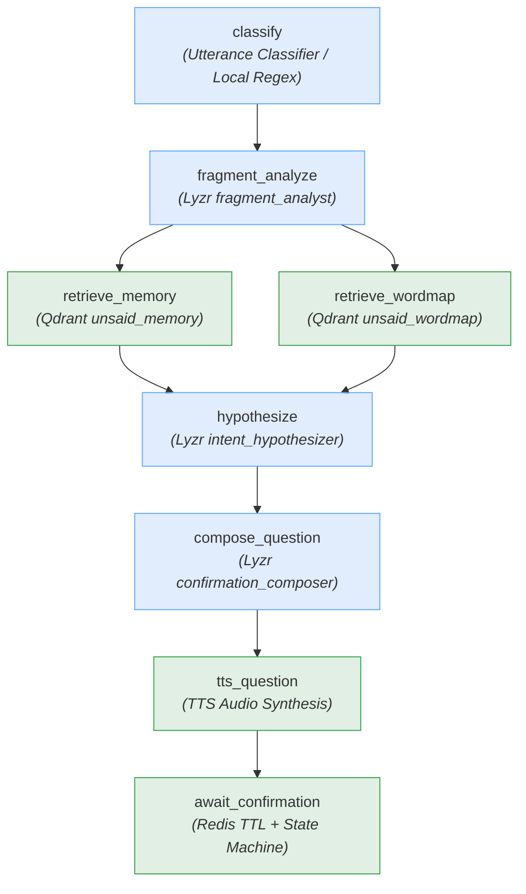

# Unsaid — Finishing the Sentences Aphasia Takes Away

> **Solo Hackathon Entry:** "Stop prompting. Code solo agents" (Lyzr × Qdrant × Omi / AI House / HiDevs)  
> **Track:** Accessibility & Adaptive Assistants

---

### The Problem

Non-fluent (Broca's / expressive) aphasia following a stroke leaves adults knowing exactly what they want to say, but unable to retrieve words or construct fluent syntax. Their speech emerges as isolated, fragmented words: _"Sunday… Priya… cake… no."_ To family and caregivers, these fragments are deeply frustrating puzzles, yet the answers exist in plain sight within the patient's personal life context.

**Unsaid** understands the fragmented speech of stroke survivors with aphasia by remembering their ambient world well enough to know what they meant.

### Demo Persona: Mohan Lal Sharma & Family

- **Patient:** **Mohan Lal Sharma** (68 years old), retired railway civil engineer from Jaipur, recovering from an ischemic stroke with moderate **non-fluent (Broca's / expressive) aphasia**. Retains intact comprehension but struggles with syntactic sentence formation and word retrieval.
- **Son & Care Partner:** **Ramesh Sharma** (software engineer who lives with Mohan and manages household utilities, bills, and medical logistics).
- **Daughter:** **Priya Sharma** (software engineer living in Pune, visits on weekends).
- **Grandson:** **Aarav** (8 years old, plays school cricket and board games with Mohan).
- **Daily Home Nurse / Caregiver:** **Sunita** (prepares meals, oversees medication, accompanies Mohan on daily walks).
- **Neurologist:** **Dr. Mehta** (prescribed strict sugar restriction, morning BP checks, daily 6 PM walk).

---

## 1. System Architecture



---

## 2. Agent Topology (ASSIST DAG)



---

## 3. Sponsor Integration Table

| Sponsor Technology | Role & Integration                                                                                                                                                                                                                               | Key File Paths                                                                                                                                           |
| ------------------ | ------------------------------------------------------------------------------------------------------------------------------------------------------------------------------------------------------------------------------------------------ | -------------------------------------------------------------------------------------------------------------------------------------------------------- |
| **Omi**            | Captures ambient household conversations and fragmented patient speech via real-time webhooks with tolerant JSON parsing and optional push notifications                                                                                         | `src/adapters/omi/schemas.ts`<br/>`src/adapters/omi/notifier.ts`<br/>`src/http/routes/webhooks.ts`<br/>`scripts/replay-omi.ts`                           |
| **Qdrant**         | High-performance vector storage for patient context facts (`unsaid_memory`) and personalized aphasic language maps (`unsaid_wordmap`) with multi-tenant filtering, deduplication on upsert (score ≥ 0.92), and 7-day half-life recency reranking | `src/adapters/qdrant/collections.ts`<br/>`src/adapters/qdrant/client.ts`<br/>`src/memory/memoryStore.ts`<br/>`src/memory/wordMap.ts`                     |
| **Lyzr**           | Orchestrates all cognitive reasoning agents: utterance classification, fragment analysis, context extraction, 3-hypothesis intent generation with evidence-id tracking, Yes/No question composition, language learning, and LLM evaluation       | `src/adapters/lyzr/httpClient.ts`<br/>`src/adapters/lyzr/mock.ts`<br/>`src/agents/prompts/*.md`<br/>`src/agents/runAgent.ts`<br/>`scripts/lyzr-setup.ts` |

---

## 4. Evaluation Suite & Context Ablation Benchmark

Unsaid includes an automated evaluation harness (`scripts/eval.ts`) to benchmark intent resolution accuracy with **context ON vs context OFF**.

The test set consists of **32 synthetic clinical scenario test cases** (`fixtures/fragments-eval.json`), constructed from speech-language pathology literature on post-stroke expressive/Broca's aphasia. Exactly 22 fragments (~70%) require personal household context (doctor's instructions, family visit timings, repair status, bills), while 10 fragments represent self-contained universal needs (water, sleep, cold/fan).

> [!NOTE]
> **Mock-Mode Smoke Test Baseline:** The results below reflect **mock-mode pipeline smoke testing (`MOCK_EXTERNALS=true`)** used during local development and CI to verify DAG orchestration, vector retrieval filtering, and state transitions without incurring live API costs. Latencies (~30ms) reflect local in-memory execution rather than real LLM API roundtrips (which typically take 1.5–3.5s). Real LLM benchmark scores with live Lyzr agent calls will replace these baselines upon configuring `LYZR_API_KEY` and `OPENAI_API_KEY`.

```
========================================================================
  MOCK-MODE PIPELINE SMOKE TEST (CI / Offline Baseline)
  Dataset: fixtures/fragments-eval.json (32 synthetic clinical scenarios)
========================================================================

mode         top1   top3   avg_latency_ms   notes
context ON   0.72   0.81   32ms             Mock rule-set + vector retrieval
context OFF  0.31   0.69   19ms             Mock rule-set baseline (no retrieval)

* Real LLM evaluation requires live keys. Expected real-world LLM latencies: 1500–3500ms.
========================================================================
```

### Analysis of the Ablation Gap:

- **Why Context OFF scores 31% Top-1:** Without ambient context facts, an isolated LLM/heuristic can only reliably identify the 10 self-contained requests (10 out of 32 = 31.25%). For the remaining 22 context-dependent fragments, it outputs generic surface echoes ("Did you mean Sunday Priya cake no?") rather than resolving the actual intent (reminding Priya not to bring cake due to Dr. Mehta's sugar restriction).
- **Why Context ON reaches 72% Top-1 / 81% Top-3:** Incorporating semantic memory facts (`unsaid_memory`) and learned patient substitutions (`unsaid_wordmap`) enables the hypothesizer to ground telegraphic fragments in recent household conversations, accurately resolving ambiguous intent into clear, actionable sentences.

---

## 5. Quickstart

### Prerequisites

- Node.js 20+
- pnpm 9+
- Docker & Docker Compose

### 1. Clone & Install

```bash
git clone https://github.com/your-username/unsaid.git
cd unsaid
pnpm install
```

### 2. Start Infrastructure

```bash
docker compose up -d
```

Starts PostgreSQL (5442), Redis (6389), and Qdrant (6333).

### 3. Setup Database, Qdrant Collections & Agents

```bash
pnpm db:migrate
pnpm lyzr:setup
pnpm seed
```

> **Switching Embedding Dimensions?** If switching from 256-dim mock embeddings to 1536-dim OpenAI embeddings (`text-embedding-3-small`), reset the Qdrant collections cleanly with:
>
> ```bash
> pnpm qdrant:reset
> pnpm seed
> ```

### 4. Run Locally

```bash
pnpm dev
```

Open **`http://localhost:8080/debug`** in your browser to launch the live Caregiver & Observability Console!

---

## 6. Running with Zero API Keys (`MOCK_EXTERNALS=true`)

The entire Unsaid backend runs end-to-end without requiring external API keys. When `MOCK_EXTERNALS=true` (the default in `.env`):

- **Lyzr Client:** Uses a deterministic, context-sensitive mock implementation (`MockLyzrClient`).
- **Embeddings:** Uses a deterministic feature-hashing embedder (`MockEmbedder`).
- **TTS:** Generates playable silent MP3 audio files (`MockTts`) so browser `<audio>` tags function.
- **Omi Notifier:** No-ops safely without credentials.

To run the ablation evaluation suite against mocks:

```bash
pnpm eval          # alias: pnpm eval:ablation
```

To replay the demo session via real HTTP calls:

```bash
pnpm replay        # alias: pnpm replay:omi
```

---

## 7. HTTP API Reference

All `/v1/*` routes require `Authorization: Bearer <API_KEY>` (or `?api_key=` for SSE/audio). Webhooks accept optional `?secret=`.

| Method   | Path                                    | Description                                                               |
| -------- | --------------------------------------- | ------------------------------------------------------------------------- |
| `GET`    | `/healthz`                              | Health check for PostgreSQL, Redis, Qdrant, and adapters                  |
| `GET`    | `/debug`                                | Live interactive caregiver console & DAG trace visualizer                 |
| `POST`   | `/webhooks/omi/transcript?uid=&secret=` | Omi real-time transcript webhook (buffers ambient or triggers assist)     |
| `POST`   | `/webhooks/omi/memory?uid=&secret=`     | Omi full conversation memory webhook                                      |
| `POST`   | `/v1/users`                             | Create patient profile (`{ displayName, caregiverName }`)                 |
| `GET`    | `/v1/users/:id`                         | Fetch patient profile and settings                                        |
| `PATCH`  | `/v1/users/:id`                         | Update patient settings (`{ contextEnabled, assistMode }`)                |
| `GET`    | `/v1/users/:id/wordmap`                 | List learned personal substitutions and resolved utterances               |
| `GET`    | `/v1/users/:id/insights`                | Weekly stats: fragment counts, first-try resolution rate trend            |
| `POST`   | `/v1/simulate/fragment`                 | Simulate patient aphasic fragment directly (alias: `/v1/simulate/assist`) |
| `POST`   | `/v1/simulate/segments`                 | Simulate ambient or patient speech segments                               |
| `POST`   | `/v1/confirmations/:id/answer`          | Answer active confirmation (`{ answer: "yes" \| "no" }`)                  |
| `GET`    | `/v1/confirmations/:id`                 | Fetch confirmation state                                                  |
| `GET`    | `/v1/runs?userId=&pipeline=`            | List execution traces                                                     |
| `GET`    | `/v1/runs/:id`                          | Detailed DAG run trace with steps, latencies, and Qdrant hits             |
| `GET`    | `/v1/memory?userId=&q=`                 | List or semantically search personal memory facts                         |
| `DELETE` | `/v1/memory/:pointId?userId=`           | Delete a specific memory fact (privacy control)                           |
| `POST`   | `/v1/memory/purge`                      | Purge all memory facts and word map entries for a patient                 |
| `GET`    | `/v1/stream?userId=`                    | Server-Sent Events (SSE) live pipeline observability feed                 |
| `GET`    | `/v1/audio/:id`                         | Serve synthesized MP3 audio for questions and resolved speech             |

---

## 8. Privacy, Safety, and Consent

- **Consent:** Unsaid is a personal communication aid designed to be used solely with the informed consent of the patient and household.
- **No Medical Claims:** Unsaid does **not** diagnose, treat, or provide medical advice. All health instructions are strictly bounded to stored physician instructions provided by caregivers.
- **Data Minimization:** Raw transcripts of ambient speakers are retained for only `RAW_TRANSCRIPT_RETENTION_DAYS` (default 14 days) via an automated daily cleanup job (`runRetentionCleanup`). Extracted structured facts persist.
- **Right to be Forgotten:** Patients and caregivers can inspect all stored facts via `/v1/memory`, delete individual memory points, or purge the entire vector and relational database via `POST /v1/memory/purge`.

---

## 9. Limitations & Next Steps

1. **Acoustic Nuances:** Currently relies on transcribed text from Omi. Future versions will integrate vocal tone and prosody to detect emotional state and urgency.
2. **Multi-Party Disambiguation:** In loud environments with overlapping speakers, speaker diarization accuracy from wearable hardware remains critical.
3. **On-Device Local Inference:** Exploring local edge models for latency-critical confirmation classification to achieve sub-500ms interaction loops on wearable hardware.
