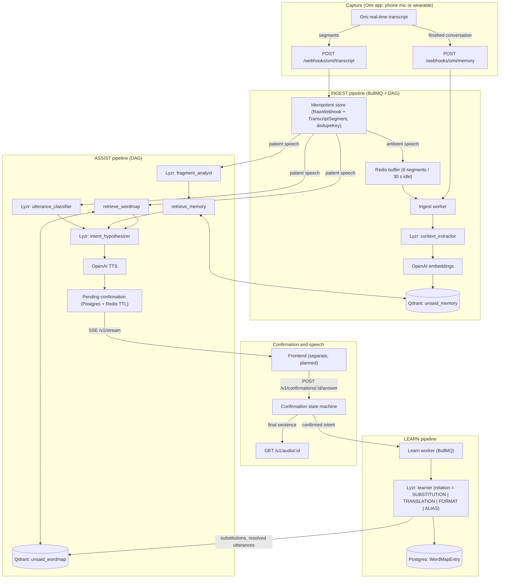
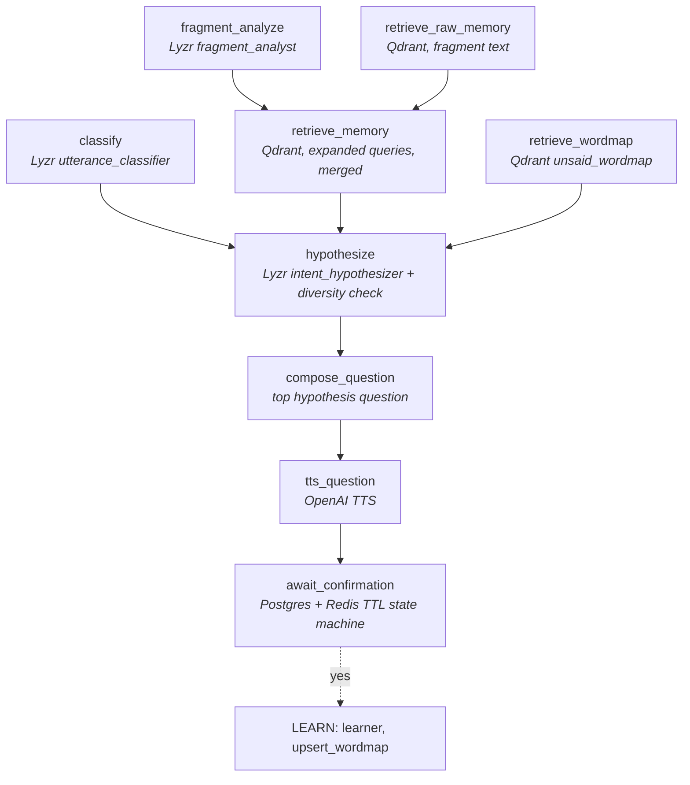

# Unsaid — Finishing the Sentences Aphasia Takes Away

> **Solo Hackathon Entry:** "Stop prompting. Code solo agents" (Lyzr × Qdrant × Omi / AI House / HiDevs)  
> **Track:** Accessibility & Adaptive Assistants

---

### The Problem

Non-fluent (Broca's / expressive) aphasia following a stroke often impairs word retrieval and sentence formation while leaving comprehension intact. Speech emerges as telegraphic, fragmented words: _"Sunday… Priya… cake… no."_ For family and caregivers, interpreting these fragments can be challenging, but the missing context is often grounded in daily routines and ambient conversations.

**Unsaid** is a communication aid, not a medical device, and it makes no diagnostic or therapeutic claims. It assists individuals with non-fluent aphasia by grounding fragmented utterances in personal background context and learned vocabulary patterns.

### Demo Persona: Mohan Lal Sharma & Family

- **Patient:** **Mohan Lal Sharma** (68 years old), retired railway civil engineer from Jaipur, recovering from an ischemic stroke with moderate **non-fluent (Broca's / expressive) aphasia**. Retains intact comprehension but struggles with syntactic sentence formation and word retrieval.
- **Son & Care Partner:** **Ramesh Sharma** (software engineer who lives with Mohan and manages household utilities, bills, and medical logistics).
- **Daughter:** **Priya Sharma** (software engineer living in Pune, visits on weekends).
- **Grandson:** **Aarav** (8 years old, plays school cricket and board games with Mohan).
- **Daily Home Nurse / Caregiver:** **Sunita** (prepares meals, oversees medication, accompanies Mohan on daily walks).
- **Neurologist:** **Dr. Mehta** (prescribed strict sugar restriction, morning BP checks, daily 6 PM walk).

---

## 1. System Architecture



## 2. Agent DAG (ASSIST)



`classify`, `fragment_analyze`, `retrieve_raw_memory` and `retrieve_wordmap` start together. With `contextEnabled=false`
the three retrieval nodes are skipped (the ablation switch). INGEST is `load_known_people → extract_facts → embed → upsert_memory`.
A "no" advances to the next of at most three hypotheses (`confirmation_composer` rewords it).

## 3. Sponsor integrations

| Sponsor    | Role                                                                                                                                                                                                   | Where                                                                                                                                                                                               |
| ---------- | ------------------------------------------------------------------------------------------------------------------------------------------------------------------------------------------------------ | --------------------------------------------------------------------------------------------------------------------------------------------------------------------------------------------------- |
| **Omi**    | Real-time transcripts (patient vs ambient via `is_user`) and finished conversations arrive by webhook; tolerant parser, raw payload storage, de-duplication, per-webhook secret, live status endpoint  | `src/adapters/omi/schemas.ts`, `src/adapters/omi/notifier.ts`, `src/http/routes/webhooks.ts`, `src/http/routes/omi.ts`, `src/ingest/recordSegment.ts`, `scripts/replay-omi.ts`, `docs/OMI_SETUP.md` |
| **Qdrant** | `unsaid_memory` (personal facts: dedup merge at cosine ≥ 0.92, 7-day-half-life recency rerank) and `unsaid_wordmap` (learned substitutions and resolved utterances); every query filtered by `userId`  | `src/adapters/qdrant/collections.ts`, `src/adapters/qdrant/client.ts`, `src/memory/memoryStore.ts`, `src/memory/wordMap.ts`                                                                         |
| **Lyzr**   | **Mandatory agent path.** Seven Studio agents (classifier, fragment analyst, context extractor, intent hypothesizer, confirmation composer, learner, eval judge) called through the Lyzr inference API | `src/adapters/lyzr/httpClient.ts`, `src/agents/runAgent.ts`, `src/agents/schemas.ts`, `src/agents/prompts/*.md`, `scripts/lyzr-setup.ts`                                                            |

Groq (`LLM_PROVIDER=groq`, `src/adapters/groq/client.ts`) exists only as a developer fallback. `MockLyzrClient` powers CI and zero-key runs.

## 4. Evaluation (live)

Every number in this section comes from `pnpm eval` / `pnpm eval:learn` run against the live stack. Nothing was re-judged or
graded by hand. Raw reports: [`docs/eval/live-eval-2026-10-04.json`](docs/eval/live-eval-2026-10-04.json) (+ `.md`) and
[`docs/eval/live-learn-2026-10-04.json`](docs/eval/live-learn-2026-10-04.json).

| Item       | Value                                                                                                                                           |
| ---------- | ----------------------------------------------------------------------------------------------------------------------------------------------- |
| Date       | 2026-10-04                                                                                                                                      |
| Agents     | Lyzr Studio agents, `gpt-4o-mini` backend (all 7, via `HttpLyzrClient`)                                                                         |
| Judge      | `eval_judge` agent on Lyzr, one fixed rubric (same core action, key entities, compatible speech act)                                            |
| Embeddings | OpenAI `text-embedding-3-small` (1536-d), Qdrant                                                                                                |
| Data       | 32 synthetic fragments in `fixtures/fragments-eval.json` (22 need personal context, 10 self-contained) and a synthetic week of household speech |

### Context ablation (32 fragments)

| Mode        | Top-1        | Top-3        | p50 latency | avg latency |
| ----------- | ------------ | ------------ | ----------- | ----------- |
| context ON  | 0.63 (20/32) | 0.94 (30/32) | 7,308 ms    | 7,480 ms    |
| context OFF | 0.63 (20/32) | 0.72 (23/32) | 6,665 ms    | 7,152 ms    |

| Subset (n)                  | ON top-1   | ON top-3   | OFF top-1  | OFF top-3  |
| --------------------------- | ---------- | ---------- | ---------- | ---------- |
| needs personal context (22) | 12 (54.5%) | 21 (95.5%) | 11 (50.0%) | 14 (63.6%) |
| self-contained (10)         | 8 (80.0%)  | 9 (90.0%)  | 9 (90.0%)  | 9 (90.0%)  |

**What this shows, and what it does not.** Retrieval from personal memory is what lifts the right meaning into the
top three (63.6% → 95.5% on context-dependent fragments). It does **not** reliably make the first guess better: top-1 was
identical in this run. An earlier live run of the same harness (a previous revision, finished concurrently with this one and
without a provenance stamp, so it is not used for headline numbers) gave ON 0.69 / 0.88 and OFF 0.63 / 0.75, so the top-3 gain
is consistent (+13 to +22 points) while the top-1 gain is within run-to-run noise. With 32 items, one fragment is 3 points.

Per-step latency (context ON, p50): classify 1.5 s, fragment_analyze 2.3 s, hypothesize 4.7 s; retrieval 13 to 18 ms. The
parallel DAG gives a p50 of **7.3 s end to end, which misses our 6 s target**; LLM generation in `hypothesize` and
`fragment_analyze` dominates.

### Learning loop (10 scenarios, `pnpm eval:learn`)

Each scenario confirms one fragment, then tests a **differently phrased** fragment with the same underlying word pattern, first
try, before vs after the learner ran.

| First-try accuracy | Before learning | After learning |
| ------------------ | --------------- | -------------- |
| Top-1 match        | 1/10 (10%)      | 3/10 (30%)     |

Two scenarios gained (a semantic substitution and a name alias), one held, seven stayed wrong. Treat +20 points on n=10 as a
signal that the loop works mechanically, not as a measured effect size. The learner labels each pair `SUBSTITUTION`,
`TRANSLATION`, `FORMAT` or `ALIAS`; only `SUBSTITUTION` is stored as a substitution (the live run rejected format pairs). The
learner still stores some questionable pairs (for example a mis-paired token), which is one reason most scenarios did not gain.

## 5. Quickstart

Prerequisites: Node 20+, pnpm, Docker.

```bash
pnpm install
docker compose up -d              # Postgres, Redis, Qdrant
cp .env.example .env              # then edit; see below for zero-key mode
pnpm db:migrate
pnpm seed                         # demo persona + a week of ambient memory
pnpm dev                          # http://localhost:8080  (/debug dev console, /docs API docs)
```

### Zero-key mock mode

Set `MOCK_EXTERNALS=true` (and leave the API keys empty). Lyzr, embeddings (feature hashing), TTS (silent MP3) and the Omi
notifier are replaced by deterministic mocks, so the whole pipeline runs offline. `pnpm test` always runs this way. Mock
output is for plumbing only: `pnpm eval` refuses to run in mock mode unless `EVAL_ALLOW_MOCK=true`, and mock numbers are never reported.

### Live mode

Fill `LYZR_API_KEY`, `OPENAI_API_KEY`, set `MOCK_EXTERNALS=false`, `LLM_PROVIDER=lyzr`, run `pnpm lyzr:setup` (creates or updates the
7 agents and writes their ids to `.env`), then `pnpm seed`. Changing `EMBEDDING_DIM` needs `pnpm qdrant:reset`.

### Useful commands

```bash
pnpm test && pnpm lint && pnpm typecheck && pnpm build   # the CI gate
pnpm eval            # live ablation   (docs/DEMO_SCRIPT.md for the demo flow)
pnpm eval:learn      # live learning loop
pnpm replay:omi      # replay the fixture week through the real webhook
pnpm openapi         # regenerate docs/openapi.yaml
```

## 6. API

OpenAPI 3.1: [`docs/openapi.yaml`](docs/openapi.yaml) (Swagger UI at `/docs` outside production). Event semantics, ordering and
the confirmation state machine: [`docs/FRONTEND_CONTRACT.md`](docs/FRONTEND_CONTRACT.md).

- **Auth:** `POST /auth/login` (demo account from env) sets an httpOnly session cookie; `POST /auth/logout`; `GET /v1/me`. Scripts use
  `Authorization: Bearer <API_KEY>`. Webhooks use their own secret.
- **Hardening:** helmet, CORS allowlist, rate limits (`/v1`, webhooks, login), 256 KB body limit, zod validation on every route, one error envelope.
- **Ops:** `/healthz` (liveness), `/readyz` (db, redis, qdrant, Lyzr config), graceful shutdown (HTTP, SSE, BullMQ, Prisma, Redis), JSON logs that never contain transcript text at `info`.
- **Docs:** [OMI_SETUP](docs/OMI_SETUP.md) · [DEPLOY](docs/DEPLOY.md) · [DEMO_SCRIPT](docs/DEMO_SCRIPT.md) · [DECISIONS](DECISIONS.md)

## 7. Frontend

> Placeholder: a separate frontend is planned and will consume the contract above. Screenshots go here.
>
> `docs/screenshots/` (live assist · trace view · memory · word map)

`public/debug.html` is a developer console only (not served in production).

## 8. Privacy, Safety, and Consent

- **Consent:** Unsaid is a personal communication aid designed to be used solely with the informed consent of the patient and household.
- **No Medical Claims:** Unsaid does **not** diagnose, treat, or provide medical advice. All health instructions are strictly bounded to stored physician instructions provided by caregivers.
- **Data Minimization:** Raw transcripts of ambient speakers are retained for only `RAW_TRANSCRIPT_RETENTION_DAYS` (default 14 days) via an automated daily cleanup job (`runRetentionCleanup`). Extracted structured facts persist.
- **Right to be Forgotten:** Patients and caregivers can inspect all stored facts via `/v1/memory`, delete individual memory points, or purge the entire vector and relational database via `POST /v1/memory/purge`.

---

## 9. Limitations (honest list)

1. **Small, synthetic, self-authored benchmark.** 32 fragments and 10 learning scenarios written by the project, judged by an LLM
   (gpt-4o-mini via Lyzr) from the same family as the system under test. No real patient data and no clinician review. Results show the
   mechanism works, not clinical effectiveness.
2. **Top-1 is not improved by context in our live run**; the benefit is in top-3 coverage (see section 4).
3. **Latency is 7 s p50**, above the 6 s goal; unsuitable for natural turn-taking without further optimisation.
4. **The learner is imperfect:** it can store wrong pairs, and the learning gain is measured on only 10 scenarios.
5. **Omi payload shape is verified against documentation only** (bare array, `uid`/`session_id` in the query). It has not yet been confirmed against a live Omi session in this repo; raw payloads are stored so any difference is easy to fix.
6. **Speech-to-text errors propagate:** Omi's transcript of disordered speech may already be wrong before Unsaid sees it.
7. **Single demo account, in-memory rate limiting** (per instance), local-disk audio. Not multi-tenant SaaS hardening.
8. **No on-device processing:** transcripts go to Omi, Lyzr/OpenAI and the configured hosts. Consent and disclosure are the operator's responsibility.
