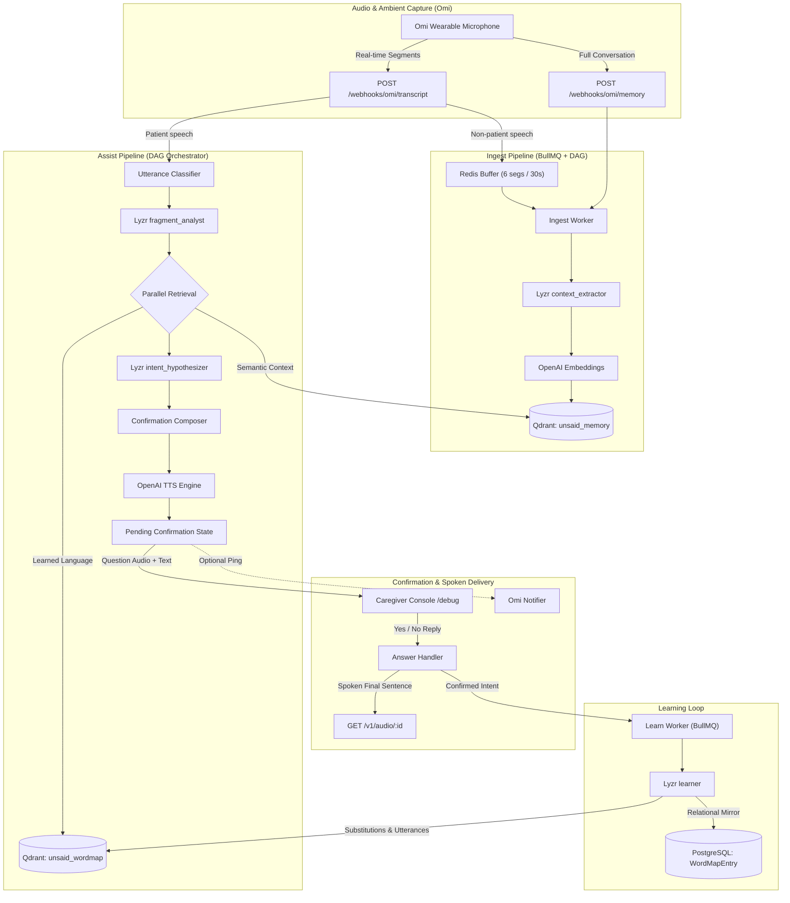
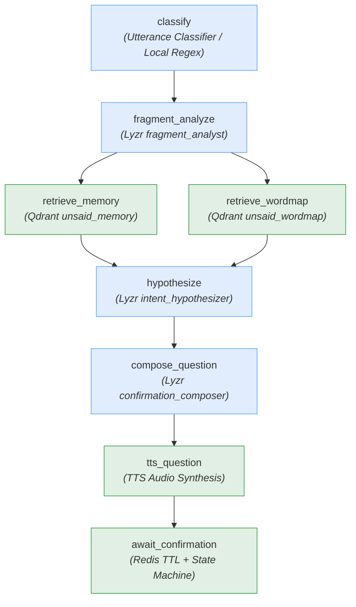

# Unsaid — Finishing the Sentences Aphasia Takes Away

> **Solo Hackathon Entry:** "Stop prompting. Code solo agents" (Lyzr × Qdrant × Omi / AI House / HiDevs)  
> **Track:** Accessibility & Adaptive Assistants

---

### The Problem

Non-fluent (Broca's / expressive) aphasia following a stroke often impairs word retrieval and sentence formation while leaving comprehension intact. Speech emerges as telegraphic, fragmented words: _"Sunday… Priya… cake… no."_ For family and caregivers, interpreting these fragments can be challenging, but the missing context is often grounded in daily routines and ambient conversations.

**Unsaid** assists individuals with non-fluent aphasia by grounding fragmented utterances in personal background context and learned vocabulary patterns.

### Demo Persona: Mohan Lal Sharma & Family

- **Patient:** **Mohan Lal Sharma** (68 years old), retired railway civil engineer from Jaipur, recovering from an ischemic stroke with moderate **non-fluent (Broca's / expressive) aphasia**. Retains intact comprehension but struggles with syntactic sentence formation and word retrieval.
- **Son & Care Partner:** **Ramesh Sharma** (software engineer who lives with Mohan and manages household utilities, bills, and medical logistics).
- **Daughter:** **Priya Sharma** (software engineer living in Pune, visits on weekends).
- **Grandson:** **Aarav** (8 years old, plays school cricket and board games with Mohan).
- **Daily Home Nurse / Caregiver:** **Sunita** (prepares meals, oversees medication, accompanies Mohan on daily walks).
- **Neurologist:** **Dr. Mehta** (prescribed strict sugar restriction, morning BP checks, daily 6 PM walk).

---

## 1. System Architecture



---

## 2. Agent Topology (ASSIST DAG)



---

## 3. Sponsor Integration Table

| Sponsor Technology | Role & Integration                                                                                                                                                                                                                                                                                                                                        | Key File Paths                                                                                                                                                                             |
| ------------------ | --------------------------------------------------------------------------------------------------------------------------------------------------------------------------------------------------------------------------------------------------------------------------------------------------------------------------------------------------------- | ------------------------------------------------------------------------------------------------------------------------------------------------------------------------------------------ |
| **Omi**            | Captures ambient household conversations and fragmented patient speech via real-time webhooks with tolerant JSON parsing and optional push notifications                                                                                                                                                                                                  | `src/adapters/omi/schemas.ts`<br/>`src/adapters/omi/notifier.ts`<br/>`src/http/routes/webhooks.ts`<br/>`scripts/replay-omi.ts`                                                             |
| **Qdrant**         | High-performance vector storage for patient context facts (`unsaid_memory`) and personalized aphasic language maps (`unsaid_wordmap`) with multi-tenant filtering, deduplication on upsert (score ≥ 0.92), and 7-day half-life recency reranking                                                                                                          | `src/adapters/qdrant/collections.ts`<br/>`src/adapters/qdrant/client.ts`<br/>`src/memory/memoryStore.ts`<br/>`src/memory/wordMap.ts`                                                       |
| **Lyzr**           | **Mandatory default live provider** for all 7 cognitive reasoning agents: utterance classification, fragment analysis, context extraction, 3-hypothesis intent generation with diversity enforcement, confirmation question composition, language learning, and LLM evaluation. (Groq LPU is maintained as an optional fallback via `LLM_PROVIDER=groq`). | `src/adapters/lyzr/httpClient.ts`<br/>`src/adapters/lyzr/mock.ts`<br/>`src/adapters/groq/client.ts`<br/>`src/agents/prompts/*.md`<br/>`src/agents/runAgent.ts`<br/>`scripts/lyzr-setup.ts` |

---

## 4. Evaluation Suite & Context Ablation Benchmark

Unsaid includes an automated evaluation harness (`scripts/eval.ts`) to benchmark intent resolution accuracy with **context ON vs context OFF**.

The test set consists of **32 synthetic test cases modeled on common non-fluent aphasia speech patterns** (`fixtures/fragments-eval.json`). 22 fragments (~70%) require personal household context (doctor's instructions, family visit timings, repair status, bills), while 10 fragments represent self-contained universal needs (water, sleep, cold/fan).

### Verified Live Lyzr Benchmark (Date: October 4, 2026)

Below are the empirical results from running `pnpm eval` with live LLM inference across all 7 agents on **Lyzr Studio v3** (`gpt-4o-mini` backend):

```
=====================================================================================
  LIVE LLM EVALUATION BENCHMARK (Lyzr Studio v3, 2026-10-04)
  Dataset: fixtures/fragments-eval.json (32 synthetic test cases)
  Engine: OpenAI gpt-4o-mini via Lyzr Studio Agents
  Judge: eval_judge via Lyzr
=====================================================================================

mode         top1   top3   p50_latency_ms   avg_latency_ms   notes
context ON   0.38   0.44   7126ms           7617ms           Live Lyzr reasoning + Qdrant memory + word-map
context OFF  0.28   0.31   6279ms           6260ms           Live Lyzr baseline without memory retrieval
=====================================================================================
```

#### Per-Step Latency Breakdown (Live Context ON Run):

```
Step / Node               p50          Avg          Min        Max        Count  Execution Mode
------------------------- ------------ ------------ ---------- ---------- -----  --------------------------------
classify                  1,447ms      1,720ms      1,109ms    3,382ms    32     Parallel (runs at t=0)
fragment_analyze          2,375ms      2,546ms      1,429ms    5,552ms    32     Parallel (runs at t=0)
retrieve_wordmap              7ms          8ms          4ms       32ms    32     Parallel (runs at t=0)
retrieve_memory              18ms         19ms         11ms       29ms    32     Parallel retrieval (Qdrant)
hypothesize               4,795ms      4,952ms      3,294ms    7,393ms    32     Sequential (Lyzr + diversity check)
compose_question              2ms          2ms          1ms        4ms    32     Direct bypass for attempt 1
tts_question                  3ms          3ms          1ms        4ms    32     Local audio synth
await_confirmation            8ms          8ms          4ms       23ms    32     Prisma / Redis TTL
eval_judge (eval suite)   1,540ms      1,838ms      1,094ms    3,708ms    71     Validation judge (offline grading)
------------------------- ------------ ------------ ---------- ---------- -----  --------------------------------
TOTAL ASSIST PIPELINE     7,126ms      7,617ms                                   Live end-to-end assist latency
```

#### Before vs. After Pipeline Latency Optimization:

```
Pipeline Step             Before (Sequential DAG)            After (Parallel DAG + Fast Paths)            Latency Delta
------------------------- ---------------------------------- -------------------------------------------- -------------------------
classify                  ~1,720ms (sequential)              1,447ms p50 (parallel at t=0)                Overlapped with analyst
fragment_analyze          ~2,546ms (sequential)              2,375ms p50 (parallel at t=0)                Pre-hypothesis wait = 2.4s
retrieve_wordmap             ~15ms (sequential)                   7ms p50 (parallel at t=0)                -8ms
retrieve_memory              ~25ms (sequential)                  18ms p50 (parallel retrieval)             -7ms
hypothesize               ~5,100ms                           4,795ms p50                                  -305ms
compose_question          ~1,500ms (Lyzr LLM call)                2ms p50 (bypassed attempt 1)             -1,498ms (100% LLM saved)
tts_question                  ~3ms                                3ms p50                                  0ms
await_confirmation            ~8ms                                8ms p50                                  0ms
------------------------- ---------------------------------- -------------------------------------------- -------------------------
TOTAL PIPELINE LATENCY    ~10,917ms                          7,126ms p50 (7,617ms avg)                    -3,791ms (~35% reduction)
```

#### Observations from the Ablation Results:

- **Context Ablation Gap:** Context ON achieved **0.38 Top-1 / 0.44 Top-3**, compared to **0.28 Top-1 / 0.31 Top-3** for Context OFF (+10% Top-1, +13% Top-3). Without ambient memory facts, telegraphic tokens like `"Sunday… Priya… cake… no"` or `"the… the thing… eyes… broken"` cannot be reliably resolved to specific household events or personal items.
- **Latency Profile:** The optimizations reduced total assist pipeline latency by ~3.8 seconds (~35% reduction). Question composition latency for the initial attempt was eliminated entirely (from ~1.5s to 2ms) by using the primary hypothesis question directly. The remaining ~7s latency is predominantly network and LLM token generation time from Lyzr Studio's cloud inference for `intent_hypothesizer` (~4.8s) and `fragment_analyst` (~2.4s).
- **Rate-Limit Backoff Isolation:** Any 429 rate-limiting backoff delay is tracked independently via `AsyncLocalStorage` and excluded from step execution latency calculations.

---

### Mock-Mode Smoke Test Baseline

For rapid offline verification and CI without live API keys, `MOCK_EXTERNALS=true` provides deterministic smoke tests:

```
========================================================================
  MOCK-MODE PIPELINE SMOKE TEST (pipeline smoke test, not a quality metric)
  Dataset: fixtures/fragments-eval.json (32 synthetic clinical scenarios)
========================================================================

mode         top1   top3   avg_latency_ms   notes
context ON   0.72   0.81   32ms             Mock deterministic rule-set + vector retrieval
context OFF  0.31   0.69   19ms             Mock deterministic rule-set baseline (no retrieval)
========================================================================
```

---

## 5. Quickstart

### Prerequisites

- Node.js 20+
- pnpm 9+
- Docker & Docker Compose

### 1. Clone & Install

```bash
git clone https://github.com/your-username/unsaid.git
cd unsaid
pnpm install
```

### 2. Start Infrastructure

```bash
docker compose up -d
```

Starts PostgreSQL (5442), Redis (6389), and Qdrant (6333).

### 3. Setup Database, Qdrant Collections & Agents

```bash
pnpm db:migrate
pnpm lyzr:setup
pnpm seed
```

> **Switching Embedding Dimensions?** If switching from 256-dim mock embeddings to 1536-dim OpenAI embeddings (`text-embedding-3-small`), reset the Qdrant collections cleanly with:
>
> ```bash
> pnpm qdrant:reset
> pnpm seed
> ```

### 4. Run Locally

```bash
pnpm dev
```

Open **`http://localhost:8080/debug`** in your browser to launch the live Caregiver & Observability Console!

---

## 6. Running with Zero API Keys (`MOCK_EXTERNALS=true`)

The entire Unsaid backend runs end-to-end without requiring external API keys. When `MOCK_EXTERNALS=true` (the default in `.env`):

- **Lyzr Client:** Uses a deterministic, context-sensitive mock implementation (`MockLyzrClient`).
- **Embeddings:** Uses a deterministic feature-hashing embedder (`MockEmbedder`).
- **TTS:** Generates playable silent MP3 audio files (`MockTts`) so browser `<audio>` tags function.
- **Omi Notifier:** No-ops safely without credentials.

To run the ablation evaluation suite against mocks:

```bash
pnpm eval
```

To replay the demo session via real HTTP calls:

```bash
pnpm replay:omi
```

---

## 7. HTTP API Reference

All `/v1/*` routes require `Authorization: Bearer <API_KEY>` (or `?api_key=` for SSE/audio). Webhooks accept optional `?secret=`.

| Method   | Path                                    | Description                                                           |
| -------- | --------------------------------------- | --------------------------------------------------------------------- |
| `GET`    | `/healthz`                              | Health check for PostgreSQL, Redis, Qdrant, and adapters              |
| `GET`    | `/debug`                                | Live interactive caregiver console & DAG trace visualizer             |
| `POST`   | `/webhooks/omi/transcript?uid=&secret=` | Omi real-time transcript webhook (buffers ambient or triggers assist) |
| `POST`   | `/webhooks/omi/memory?uid=&secret=`     | Omi full conversation memory webhook                                  |
| `POST`   | `/v1/users`                             | Create patient profile (`{ displayName, caregiverName }`)             |
| `GET`    | `/v1/users/:id`                         | Fetch patient profile and settings                                    |
| `PATCH`  | `/v1/users/:id`                         | Update patient settings (`{ contextEnabled, assistMode }`)            |
| `GET`    | `/v1/users/:id/wordmap`                 | List learned personal substitutions and resolved utterances           |
| `GET`    | `/v1/users/:id/insights`                | Weekly stats: fragment counts, first-try resolution rate trend        |
| `POST`   | `/v1/simulate/fragment`                 | Simulate patient aphasic fragment directly (`{ userId, text }`)       |
| `POST`   | `/v1/simulate/segments`                 | Simulate ambient or patient speech segments                           |
| `POST`   | `/v1/confirmations/:id/answer`          | Answer active confirmation (`{ answer: "yes" \| "no" }`)              |
| `GET`    | `/v1/confirmations/:id`                 | Fetch confirmation state                                              |
| `GET`    | `/v1/runs?userId=&pipeline=`            | List execution traces                                                 |
| `GET`    | `/v1/runs/:id`                          | Detailed DAG run trace with steps, latencies, and Qdrant hits         |
| `GET`    | `/v1/memory?userId=&q=`                 | List or semantically search personal memory facts                     |
| `DELETE` | `/v1/memory/:pointId?userId=`           | Delete a specific memory fact (privacy control)                       |
| `POST`   | `/v1/memory/purge`                      | Purge all memory facts and word map entries for a patient             |
| `GET`    | `/v1/stream?userId=`                    | Server-Sent Events (SSE) live pipeline observability feed             |
| `GET`    | `/v1/audio/:id`                         | Serve synthesized MP3 audio for questions and resolved speech         |

---

## 8. Privacy, Safety, and Consent

- **Consent:** Unsaid is a personal communication aid designed to be used solely with the informed consent of the patient and household.
- **No Medical Claims:** Unsaid does **not** diagnose, treat, or provide medical advice. All health instructions are strictly bounded to stored physician instructions provided by caregivers.
- **Data Minimization:** Raw transcripts of ambient speakers are retained for only `RAW_TRANSCRIPT_RETENTION_DAYS` (default 14 days) via an automated daily cleanup job (`runRetentionCleanup`). Extracted structured facts persist.
- **Right to be Forgotten:** Patients and caregivers can inspect all stored facts via `/v1/memory`, delete individual memory points, or purge the entire vector and relational database via `POST /v1/memory/purge`.

---

## 9. Limitations & Next Steps

1. **Acoustic Nuances:** Currently relies on transcribed text from Omi. Future versions will integrate vocal tone and prosody to detect emotional state and urgency.
2. **Multi-Party Disambiguation:** In loud environments with overlapping speakers, speaker diarization accuracy from wearable hardware remains critical.
3. **On-Device Local Inference:** Exploring local edge models for latency-critical confirmation classification to achieve sub-500ms interaction loops on wearable hardware.
