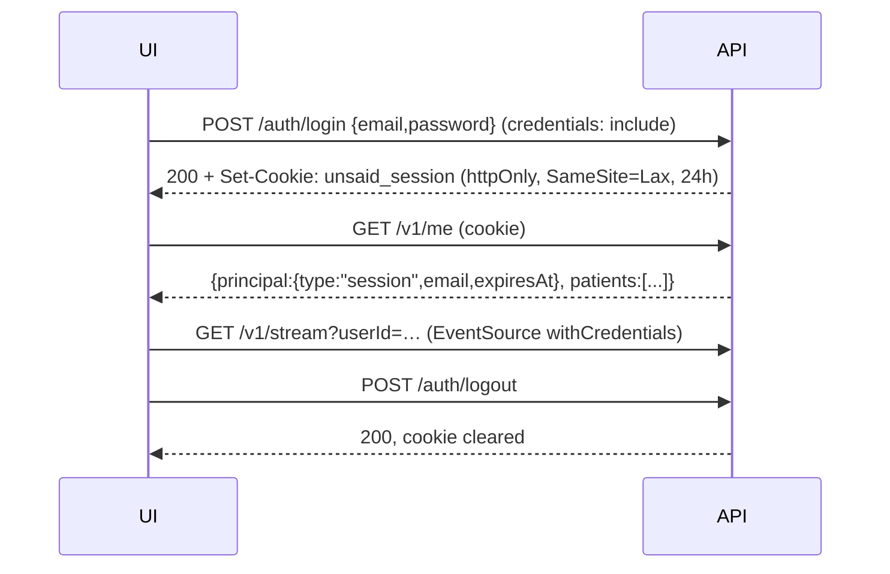
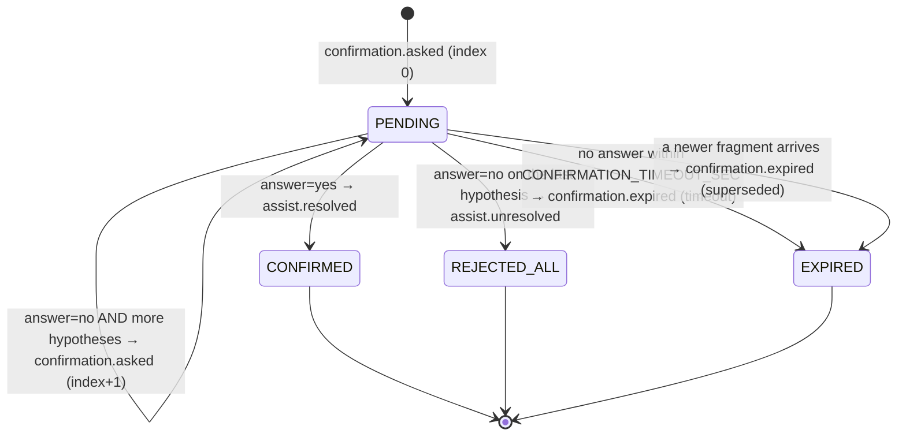

# Frontend contract

Everything a UI needs to talk to the Unsaid backend. Machine-readable schemas live in
[`openapi.yaml`](./openapi.yaml) (OpenAPI 3.1, generated from the zod schemas with `pnpm openapi`; Swagger UI at
`/docs` outside production). This page covers what a spec cannot: event semantics, ordering, and state machines.

> Unsaid is a communication aid. UI copy must not make diagnostic or therapeutic claims.

## 1. Conventions

| Topic            | Contract                                                                                                                                                                                                                                                           |
| ---------------- | ------------------------------------------------------------------------------------------------------------------------------------------------------------------------------------------------------------------------------------------------------------------ |
| Base URL         | `http://localhost:8080` locally; the deployed API URL otherwise                                                                                                                                                                                                    |
| Success envelope | `{ "ok": true, "data": ... }` (a few write endpoints return flat fields such as `processed`, `deleted`; see the spec)                                                                                                                                              |
| Error envelope   | `{ "error": { "code", "message", "requestId", "details?" } }` for **every** error, including 404/413/429. `code` is snake_case: `validation_error`, `unauthorized`, `forbidden`, `not_found`, `rate_limited`, `payload_too_large`, `invalid_json`, `internal`, ... |
| Request id       | Every response has `x-request-id`; quote it when reporting problems                                                                                                                                                                                                |
| Rate limits      | `/v1/*`: 120/min/IP, webhooks 300/min/IP, login 10/15 min/IP. `429` + `RateLimit-*` headers                                                                                                                                                                        |
| CORS             | Only origins in the server's `CORS_ORIGINS` allowlist; credentials allowed                                                                                                                                                                                         |
| Body limit       | 256 KB JSON                                                                                                                                                                                                                                                        |
| Patient id       | `userId` / `{id}` are opaque strings from `GET /v1/me` → `patients[]` or `POST /v1/users`                                                                                                                                                                          |

## 2. Auth flow



- One demo account, configured by the operator (`DEMO_EMAIL` / `DEMO_PASSWORD`).
- The cookie is `httpOnly`: JavaScript cannot read it; always call with `credentials: "include"` / `withCredentials: true`.
- Same-site deployments (UI and API on one registrable domain) use the default `SameSite=Lax`. A UI on a different
  site needs the operator to set `COOKIE_SAMESITE=none` (forces `Secure`) **and** list the UI origin in `CORS_ORIGINS`.
- Cookie-authenticated writes (`POST/PATCH/DELETE`) must come from an allowlisted `Origin` (CSRF defence); otherwise `403 forbidden`.
- `401 unauthorized` → send the user to the login screen. Sessions expire after 24 h.
- Scripts can use `Authorization: Bearer <API_KEY>` instead. Webhooks use a separate secret and are not for UIs.

```bash
curl -i -c jar.txt -H 'content-type: application/json' \
  -d '{"email":"demo@example.com","password":"…"}' http://localhost:8080/auth/login
curl -b jar.txt http://localhost:8080/v1/me
curl -b jar.txt -X POST http://localhost:8080/auth/logout
```

## 3. SSE: `GET /v1/stream?userId=<id>`

```js
const es = new EventSource(`${API}/v1/stream?userId=${id}`, { withCredentials: true });
es.addEventListener('confirmation.asked', (e) => render(JSON.parse(e.data)));
```

- One long-lived connection per patient; the server pings every 15 s (`: ping` comment) and suggests `retry: 3000`.
- Each frame is `event: <type>` and `data: <EventEnvelope>`:

```json
{ "type": "step.completed", "userId": "…", "runId": "…", "ts": "2026-10-04T08:28:58.751Z", "data": {} }
```

- Events are **not replayed**. After a reconnect, reload state with `GET /v1/runs?userId=…`, `GET /v1/runs/{id}` and
  `GET /v1/confirmations/{id}`.
- Browsers cannot set headers on `EventSource`; use the session cookie (or `?api_key=` for scripts only).
- Ordering is guaranteed within a run. Events from concurrent steps (see §5) interleave.

### Event types

`runId` is present on every event tied to a pipeline run. Payloads below are real captures from the mock pipeline
(ids shortened).

#### `segment.received` — a transcript segment was stored (once per unique segment)

```json
{
  "segmentId": "a381b1…",
  "isUser": false,
  "sessionId": "s1",
  "source": "SIMULATED",
  "textLength": 49,
  "text": "Ramesh said he will pay the water bill on Friday."
}
```

`source` is `OMI_REALTIME` | `OMI_MEMORY` | `SIMULATED`. `isUser: true` means the patient spoke it. Duplicate Omi
resends do **not** emit this event again.

#### `run.started` / `run.completed` — a pipeline run began / ended

```json
{ "pipeline": "ASSIST", "contextUsed": true }
{ "status": "SUCCEEDED", "output": "{\"factsCount\":3}" }
```

`pipeline` is `ASSIST` (fragment → confirmation), `INGEST` (ambient window → memory) or `LEARN` (confirmation → word map).
For ASSIST, `run.completed` is **not** emitted when the user answers; the run stays `AWAITING_CONFIRMATION` and is
finished by `assist.resolved` / `assist.unresolved` / `confirmation.expired` (use those as the terminal signals).

#### `step.started` / `step.completed` / `step.failed` — DAG node lifecycle

```json
{ "stepId": "…", "node": "classify", "startOffsetMs": 3, "service": { "provider": "lyzr", "name": "utterance_classifier" } }
{ "stepId": "…", "node": "retrieve_memory", "startOffsetMs": 1522, "service": { "provider": "qdrant", "name": "unsaid_memory" }, "latencyMs": 6, "backoffMs": 0, "status": "COMPLETED",
  "outputPreview": "[{\"id\":…}]",
  "retrieval": [
    { "id": "16d232…", "type": "routine", "text": "Municipal water bill is due this week, Ramesh handles payment", "score": 0.698 },
    { "id": "b34c3e…", "type": "event", "text": "Priya (daughter) is visiting on Sunday morning from Pune", "score": 0.471 }
  ] }
```

- `startOffsetMs` is the step start in ms from `run.started`. Parallel steps share one timeline: draw each bar at
  `startOffsetMs` with width `latencyMs`. `GET /v1/runs/{id}` returns the same two fields on every step.
- `service` tags the step: `provider` is `lyzr` (`name` = agent), `qdrant` (`name` = collection), `openai` (embeddings),
  `tts`, `redis` or `local`.
- `latencyMs` excludes rate-limit backoff (`backoffMs` is reported separately).
- `retrieval` (only on `retrieve_memory`, `retrieve_raw_memory`, `retrieve_wordmap`) is the list of Qdrant hits with cosine-based `score`.
- A node skipped by design (e.g. retrieval with context OFF) arrives as `step.completed` with `"status": "SKIPPED"`.
- `step.failed` carries `error` and the same fields; dependents are skipped and the run degrades or fails.
- Nodes: ASSIST `classify, fragment_analyze, retrieve_raw_memory, retrieve_memory, retrieve_wordmap, hypothesize, compose_question, tts_question, await_confirmation`; INGEST `load_known_people, extract_facts, embed, upsert_memory`; LEARN `learner, upsert_wordmap`.

#### `segment.classified` — what kind of utterance this was

```json
{ "kind": "FRAGMENT", "reason": "Fragmented telegraphic aphasic speech", "source": "agent" }
```

`kind`: `FRAGMENT` | `FLUENT` | `CONFIRMATION_REPLY` | `NOISE`. Only `FRAGMENT` proceeds to hypotheses.

#### `hypotheses.generated` — the ranked candidate meanings

```json
{
  "normalizedFragment": "water… Ramesh… bill",
  "hypotheses": [
    {
      "rank": 0,
      "intent": "Ask Ramesh if the municipal water bill was paid",
      "sentence": "Did Ramesh pay the municipal water bill?",
      "question": "Are you asking if Ramesh paid the water bill?",
      "confidence": 0.88,
      "evidenceIds": ["16d232…"]
    }
  ]
}
```

`evidenceIds` are memory point ids (match them against `retrieval[].id` of `retrieve_memory`) so a UI can show _why_.
`normalizedFragment` is the fragment after learned substitutions were applied.

#### `confirmation.asked` — show the yes/no question and play the audio

```json
{
  "confirmationId": "…",
  "question": "Are you asking if Ramesh paid the water bill?",
  "questionAudio": "615c21…",
  "audioUrl": "/v1/audio/615c21…",
  "currentIndex": 0,
  "hypothesesCount": 3,
  "hypotheses": [{ "intent": "…", "sentence": "…" }]
}
```

Emitted once per question: the first, and again after every `no` while hypotheses remain. `audioUrl` is relative to the API origin
and plays in a plain `<audio>` element (no auth header needed).

#### `confirmation.answered`

```json
{ "confirmationId": "…", "answer": "no", "answeredIndex": 0 }
```

Emitted for answers from the UI **and** for spoken "yes"/"no" detected from the transcript.

#### `assist.resolved` — the patient confirmed a meaning

```json
{
  "confirmationId": "…",
  "finalSentence": "Please remind Ramesh to pay the water bill today.",
  "finalAudio": "0ad2ca…",
  "audioUrl": "/v1/audio/0ad2ca…"
}
```

Speak/show `finalSentence`. A LEARN run is queued right after.

#### `assist.unresolved` — every hypothesis was rejected

```json
{ "confirmationId": "…", "fallbackQuestion": "Is this about a person, a place, or something you need?" }
```

#### `confirmation.expired` — no answer in time, or a newer fragment superseded it

```json
{ "confirmationId": "…", "reason": "timeout" }
```

`reason`: `timeout` (45 s default) or `superseded`.

#### `memory.upserted` — a personal fact was stored or merged (INGEST)

```json
{
  "id": "b34c3e…",
  "merged": false,
  "fact": {
    "type": "event",
    "text": "Priya (daughter) is visiting on Sunday morning from Pune",
    "entities": ["Priya", "Sunday", "Pune"],
    "aliases": ["beti"],
    "confidence": 0.95,
    "mentions": 1
  }
}
```

#### `wordmap.updated` — LEARN finished

```json
{
  "fragment": "car… park… six",
  "confirmedSentence": "It is time for our evening walk in the park.",
  "substitutions": [{ "said": "car", "meant": "walk", "relation": "SUBSTITUTION" }],
  "nameAliases": [],
  "summary": "…"
}
```

Only pairs the learner classified as `SUBSTITUTION` are stored in the word map; refetch `GET /v1/users/{id}/wordmap` to render it.

## 4. ASSIST trace lifecycle

Happy path with one rejection, in emission order for a single fragment (`POST /v1/simulate/fragment` or an Omi
`is_user` segment):

```text
segment.received                       (source of the fragment)
run.started                            pipeline=ASSIST
step.started  classify
segment.classified                     kind=FRAGMENT
step.completed classify
step.started  fragment_analyze / retrieve_raw_memory / retrieve_wordmap      (parallel with classify)
step.completed … (any order)           retrieval nodes carry retrieval[]
step.started  retrieve_memory          (after fragment_analyze: query expansion)
step.completed retrieve_memory
step.started  hypothesize
hypotheses.generated
step.completed hypothesize
step.started/completed compose_question, tts_question
step.started  await_confirmation
confirmation.asked                     currentIndex=0   ← UI: show question, play audio
step.completed await_confirmation
confirmation.answered                  answer=no
confirmation.asked                     currentIndex=1
confirmation.answered                  answer=yes
assist.resolved                        ← terminal for the ASSIST run; UI: speak finalSentence
run.started  pipeline=LEARN … wordmap.updated … run.completed   (async, seconds later)
```

Notes for UI authors:

- `classify`, `fragment_analyze`, `retrieve_raw_memory` and `retrieve_wordmap` start together; do not assume order between them.
- If the fragment is not classified `FRAGMENT`, `hypothesize` is skipped and no confirmation is created.
- With the patient's `contextEnabled=false` (ablation toggle, `PATCH /v1/users/{id}`) the retrieval nodes are `SKIPPED` and `evidenceIds` are empty.
- With `assistMode=OFF` no run starts at all.
- `POST /v1/simulate/fragment` returns `{runId, confirmationId}` as soon as the first question exists; everything after arrives over SSE.

## 5. Confirmation state machine



- At most one `PENDING` confirmation per patient. A new fragment supersedes the old one.
- Max 3 hypotheses. `currentIndex` says which one the on-screen question refers to.
- Answering a confirmation that is no longer `PENDING` is a safe no-op that returns its final state (double-taps are fine).
- A spoken "yes/no" (including "haan/nahi") while a confirmation is pending answers it without any LLM call.
- `GET /v1/confirmations/{id}` returns the full row (`status`, `hypotheses`, `currentIndex`, `finalSentence`, `resolution`).

## 6. Main flows with curl

```bash
export API=http://localhost:8080 KEY=dev-key
H=(-H "Authorization: Bearer $KEY" -H 'content-type: application/json')

# 1. create or pick a patient
curl "${H[@]}" -X POST $API/v1/users -d '{"displayName":"Mohan Lal Sharma","caregiverName":"Ramesh"}'
curl "${H[@]}" $API/v1/me                                   # patients[]

# 2. watch events (separate terminal)
curl -N "$API/v1/stream?userId=$USER_ID&api_key=$KEY"

# 3. feed ambient context, then a fragment
curl "${H[@]}" -X POST $API/v1/simulate/segments -d '{"userId":"'$USER_ID'","segments":[
  {"text":"Ramesh said he will pay the water bill on Friday.","isUser":false}]}'
curl "${H[@]}" -X POST $API/v1/simulate/fragment -d '{"userId":"'$USER_ID'","text":"water… Ramesh… bill"}'

# 4. answer the confirmation (id from the response or the confirmation.asked event)
curl "${H[@]}" -X POST $API/v1/confirmations/$CONF_ID/answer -d '{"answer":"yes"}'

# 5. trace, memory, word map, insights
curl "${H[@]}" "$API/v1/runs?userId=$USER_ID&pipeline=ASSIST&limit=5"
curl "${H[@]}" $API/v1/runs/$RUN_ID                         # steps, latencies, retrieval hits
curl "${H[@]}" "$API/v1/memory?userId=$USER_ID&q=water%20bill"
curl "${H[@]}" $API/v1/users/$USER_ID/wordmap
curl "${H[@]}" $API/v1/users/$USER_ID/insights

# 6. context ablation toggle (compare answers with memory OFF)
curl "${H[@]}" -X PATCH $API/v1/users/$USER_ID -d '{"contextEnabled":false}'

# 7. privacy controls
curl "${H[@]}" -X DELETE "$API/v1/memory/$POINT_ID?userId=$USER_ID"
curl "${H[@]}" -X POST $API/v1/memory/purge -d '{"userId":"'$USER_ID'"}'

# 8. is the Omi live path delivering?
curl "${H[@]}" "$API/v1/omi/status?userId=$USER_ID"
```

## 7. Suggested screens → endpoints

| Screen                     | Data                                                                                 |
| -------------------------- | ------------------------------------------------------------------------------------ |
| Login                      | `POST /auth/login`, `GET /v1/me`                                                     |
| Live assist (caregiver)    | SSE `confirmation.asked`, `hypotheses.generated`, `assist.resolved`; answer endpoint |
| Trace / "why this guess"   | SSE `step.*` with `retrieval[]`; `GET /v1/runs/{id}` after the fact                  |
| Memory (privacy)           | `GET /v1/memory`, `DELETE /v1/memory/{id}`, `POST /v1/memory/purge`                  |
| Word map & insights        | `GET /v1/users/{id}/wordmap`, `GET /v1/users/{id}/insights`                          |
| Context ON/OFF demo toggle | `PATCH /v1/users/{id}` `{contextEnabled}`                                            |
| Omi connection status      | `GET /v1/omi/status`                                                                 |
